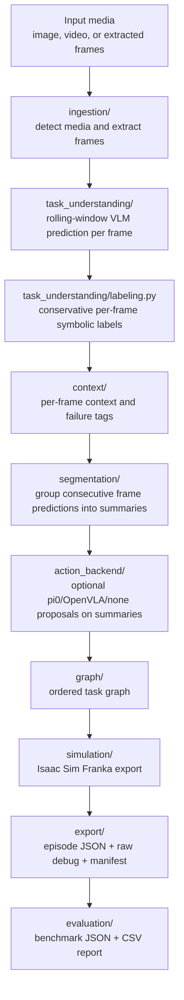

# RoboTaskManipulator

RoboTaskManipulator is a practical v1 backend for turning photos, videos, or ordered extracted frames into per-frame semantic predictions, grouped task summaries, conservative symbolic robot-action labels, Isaac Sim task plans, and lightweight evaluation reports.

v1 is built around pretrained inference. It does not require training a new model.

## What It Does

Input:
- single image payloads
- video payloads with automatic frame extraction
- explicit ordered frame-sequence payloads

Output:
- one semantic prediction per frame
- grouped task summaries derived from consecutive frame predictions
- conservative symbolic action labels
- lightweight context/failure tags
- ordered task graph links
- Isaac Sim 5.1 / Franka Panda export
- per-episode JSON, raw debug JSON, batch manifest, and optional evaluation reports

## Product Pipeline



## Model Roles

Semantic understanding:
- primary engine for v1
- implemented through `task_understanding/`
- default backend is a pretrained multimodal instruction VLM (`Qwen/Qwen2.5-VL-7B-Instruct`)
- it runs one prediction per frame using a small rolling context window
- it can load from a Hugging Face id or a local downloaded model directory on a Lambda VM
- if the VLM is unavailable, the code falls back to conservative visual heuristics instead of fabricating certainty

Action backend:
- optional
- implemented through `action_backend/`
- default is `none`
- supported choices are `none`, `pi0`, and a reserved `openvla` slot
- `pi0` is used for robot-oriented action proposals and action chunks, not as the main semantic engine

## Folder Layout

- `configs/`: example runtime configuration
- `data/`: sample inputs, benchmark examples, and generated outputs
- `docs/`: architecture notes and project-specific guidance
- `scripts/`: runnable entry points for single inference, batch annotation, and evaluation
- `src/robotask_manipulator/ingestion/`: media detection and frame extraction
- `src/robotask_manipulator/segmentation/`: grouped step summaries derived from frame predictions
- `src/robotask_manipulator/task_understanding/`: frame-level semantic VLM backend plus symbolic labeling
- `src/robotask_manipulator/action_backend/`: optional robot-oriented backends such as pi0
- `src/robotask_manipulator/context/`: context and failure tagging
- `src/robotask_manipulator/graph/`: ordered task graph construction
- `src/robotask_manipulator/simulation/`: Isaac Sim / Franka Panda export
- `src/robotask_manipulator/evaluation/`: benchmark scoring and report generation
- `src/robotask_manipulator/export/`: final JSON artifact writing
- `src/robotask_manipulator/schemas/`: typed data contracts
- `src/robotask_manipulator/utils/`: focused shared utilities
- `src/robotask_manipulator/main.py`: the end-to-end product orchestrator
- `tests/`: product-focused tests

## Input Payloads

Single image:

```json
{
  "episode_id": "demo-001",
  "task_name": "pick_and_place",
  "instruction": "Pick the block and place it on the pad.",
  "asset_path": "sample_frame_001.ppm",
  "state": [0.0, 0.0, 0.0, 0.0]
}
```

Frame sequence:

```json
{
  "episode_id": "workflow-001",
  "task_name": "battery_insert_sequence",
  "instruction": "Pick the battery, align it with the slot, insert it, then inspect the fit.",
  "frames": [
    {"frame_id": "frame-000", "asset_ref": "sample_frame_001.ppm", "frame_index": 0, "timestamp_s": 0.0},
    {"frame_id": "frame-001", "asset_ref": "sample_frame_002.ppm", "frame_index": 1, "timestamp_s": 0.5}
  ]
}
```

Video:
- provide `asset_path` or `media_path` pointing to a video file
- v1 can process every frame by default
- set `video_frame_stride` if you want to downsample intentionally
- set `long_video_frame_count_threshold` plus `long_video_frame_stride` if you want long clips to downsample automatically
- raw video decoding is supported through OpenCV-based extraction

Hinted video payload:

```json
{
  "episode_id": "real-video-001",
  "task_name": "ethernet_cable_insert",
  "instruction": "Describe only the visible hand-object action conservatively.",
  "asset_path": "test_video.mp4",
  "metadata": {
    "tags": ["ethernet cable", "laptop port", "network connector"]
  }
}
```

Those metadata tags are treated as soft hints for the semantic model. They help the model prefer phrases like `hold cable near port` or `insert cable into port` when the frames support them, but they do not hard-force the label.

## Running It

Install:

```bash
python -m venv .venv
.venv\Scripts\activate
pip install -r requirements.txt
```

That installs the base stack for:
- media ingestion
- segmentation
- task understanding
- symbolic labeling
- export
- evaluation

Optional `pi0` support is intentionally not required for this workflow.
If you enable `pi0` later, treat it as a separate optional environment and capability path.

Download a semantic model locally for Lambda or any offline VM:

```bash
py -3 scripts\download_semantic_model.py ^
  --model-id Qwen/Qwen2.5-VL-7B-Instruct ^
  --output-dir C:\models\Qwen2.5-VL-7B-Instruct
```

Single inference:

```bash
py -3 scripts\run_single_inference.py ^
  --input data\sample_inputs\sample_workflow_episode_001.json ^
  --semantic-model-path C:\models\Qwen2.5-VL-7B-Instruct ^
  --semantic-offline
```

Colab-friendly real image/video demo:

```bash
py -3 scripts\run_colab_video_demo.py ^
  --image-path test_image.jpg ^
  --video-path test_video.mp4 ^
  --config configs\colab_refined_video.yaml ^
  --task-name ethernet_cable_insert ^
  --instruction "Describe only the visible hand-object action conservatively." ^
  --tag "ethernet cable" ^
  --tag "laptop port" ^
  --tag "network connector" ^
  --zip-outputs
```

Use real pi0 proposals:

```bash
pip install -r requirements-pi0.txt
py -3 scripts\run_single_inference.py ^
  --input data\sample_inputs\sample_workflow_episode_001.json ^
  --action-backend pi0 ^
  --model-id lerobot/pi0_base
```

If upstream package resolver conflicts appear for `pi0`, keep using the base semantic-testing environment and set `--action-backend none` until you are specifically ready to work on robot-action proposals.

Batch mode:

```bash
py -3 scripts\batch_annotate.py --input-dir data\sample_inputs
```

Batch mode with evaluation:

```bash
py -3 scripts\batch_annotate.py ^
  --input-dir data\sample_inputs ^
  --benchmark data\benchmarks\sample_benchmark.json
```

Standalone evaluation:

```bash
py -3 scripts\evaluate_benchmark.py ^
  --predictions-dir data\outputs ^
  --benchmark data\benchmarks\sample_benchmark.json
```

## Configuration

Config can come from:
- `configs/settings.example.yaml`
- environment variables
- CLI overrides

Useful env vars:
- `RTM_VIDEO_FRAME_STRIDE`
- `RTM_LONG_VIDEO_FRAME_COUNT_THRESHOLD`
- `RTM_LONG_VIDEO_FRAME_STRIDE`
- `RTM_MAX_FRAMES`
- `RTM_SEMANTIC_BACKEND`
- `RTM_SEMANTIC_MODEL_ID`
- `RTM_SEMANTIC_MODEL_PATH`
- `RTM_SEMANTIC_DEVICE`
- `RTM_SEMANTIC_OFFLINE`
- `RTM_FRAME_CONTEXT_RADIUS`
- `RTM_ACTION_BACKEND`
- `PI0_MODEL_ID`
- `PI0_CHECKPOINT_PATH`
- `PI0_DEVICE`
- `PI0_DTYPE`
- `PI0_OFFLINE`

For Colab or Lambda-style video testing, see `configs/colab_refined_video.yaml` for a practical starting point that keeps Qwen on GPU while downsampling longer videos and producing cleaner grouped segments.
The repo also includes `scripts/run_colab_video_demo.py` plus `colab_refined_video_test.ipynb` as a thin Colab wrapper around that demo script.

## Isaac Sim Export

The simulation layer generates a simulation-ready task plan for:
- simulator: Isaac Sim 5.1
- robot: Franka Panda

Each exported step includes:
- ordered primitive label
- semantic description
- source/target object fields when available
- confidence
- status
- optional action proposal
- context/failure tags

The main episode JSON also includes:
- `frame_predictions`: one semantic result per frame
- `segments`: grouped summaries derived from consecutive frame predictions

The exporter is intentionally focused on generating clean structured plans, not directly launching Isaac Sim.

## Evaluation Flow

Benchmark episodes define:
- expected ordered steps
- expected symbolic labels
- optional success outcomes

The evaluation layer currently computes:
- step count difference
- step label agreement
- ordering agreement
- per-episode pass / needs-review summary

Reports are written as:
- JSON
- CSV

## Known Limitations

- Semantic understanding is frame-first and VLM-driven, but it is still conservative and not guaranteed to hit benchmark-quality step descriptions on every real video.
- `Qwen/Qwen2.5-VL-7B-Instruct` is significantly heavier than the earlier small demo model and is best run on a capable local GPU VM.
- `pi0` proposals are optional and embodiment-sensitive.
- Optional `pi0` support should be treated as a separate capability path, not part of the default semantic-testing environment.
- Grouped step summaries are still heuristic and derived from consecutive per-frame predictions rather than a learned temporal summarizer.
- Context/failure tags are lightweight heuristics and do not imply true physics certainty.
- Isaac Sim export is plan-oriented; direct sim execution is intentionally out of scope for v1.
- `OpenVLA` is represented as a clean backend slot but is not wired up in this build.

## Current Default Behavior

- semantic understanding: enabled
- per-frame task understanding: enabled
- grouped summary segments: enabled
- symbolic labeling: enabled
- action backend: `none`
- Isaac Sim export: enabled
- evaluation: optional when benchmark truth is provided

That default keeps the product easy to run end to end on photos/videos while preserving a path to richer robot-oriented proposals with `pi0`.
